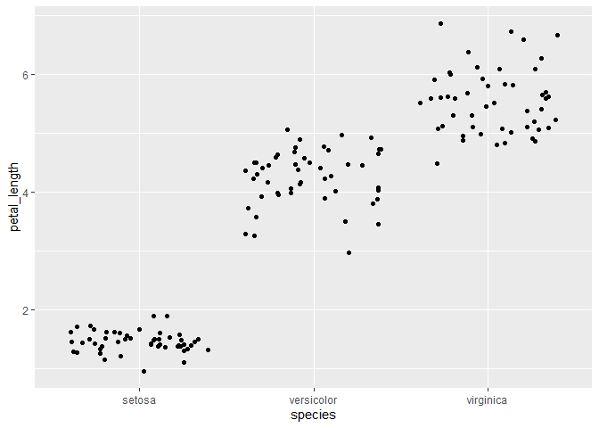

Lab 5 Assignment
================
Connor Hayes
2021-02-23

# This lab is to help manipulate and understand tables, as well as learn about taking information from a table and graphing it on a plot.

# Load Packages

``` r
library(tidyverse)
```

    ## -- Attaching packages --------------------------------------- tidyverse 1.3.0 --

    ## v ggplot2 3.3.3     v purrr   0.3.4
    ## v tibble  3.0.4     v dplyr   1.0.2
    ## v tidyr   1.1.2     v stringr 1.4.0
    ## v readr   1.4.0     v forcats 0.5.0

    ## -- Conflicts ------------------------------------------ tidyverse_conflicts() --
    ## x dplyr::filter() masks stats::filter()
    ## x dplyr::lag()    masks stats::lag()

``` r
iris <- as_tibble(iris)
```

# Question \#1

``` r
iris_pt2 <- rename(iris, sepal_length = Sepal.Length,
                    sepal_width = Sepal.Width, 
       petal_length = Petal.Length,
       petal_width =  Petal.Width,
       species = Species)
```

\#Question \#2

``` r
a1 <- select(iris_pt2, sepal_length, sepal_width, petal_length, petal_width, species)
   mutate(a1,  sepal_length = sepal_length * 10,
       sepal_width = sepal_width * 10, 
        petal_length = petal_length * 10, 
       petal_width = petal_width * 10)
```

    ## # A tibble: 150 x 5
    ##    sepal_length sepal_width petal_length petal_width species
    ##           <dbl>       <dbl>        <dbl>       <dbl> <fct>  
    ##  1           51          35           14           2 setosa 
    ##  2           49          30           14           2 setosa 
    ##  3           47          32           13           2 setosa 
    ##  4           46          31           15           2 setosa 
    ##  5           50          36           14           2 setosa 
    ##  6           54          39           17           4 setosa 
    ##  7           46          34           14           3 setosa 
    ##  8           50          34           15           2 setosa 
    ##  9           44          29           14           2 setosa 
    ## 10           49          31           15           1 setosa 
    ## # ... with 140 more rows

# Question \#3

``` r
a3 <- mutate(a1, sepal_area = sepal_length * sepal_width, 
             petal_area = petal_length * petal_width )
a4 <- select(a3, sepal_area, petal_area)
```

\#Question \#4

``` r
d2 <- select(a1, sepal_length)

summarize (a1,
          sampl_size= n(),
          max_sepal.length = max(sepal_length),
          min_sepal.length = min(sepal_length),
          range_sepal.length = range(max_sepal.length - min_sepal.length),         
          median_sepal_length = median(sepal_length),         
          first_quartile_sepal_length = quantile(sepal_length, probs = 0.25),
           IQR_sepal_length = IQR(sepal_length))
```

    ## # A tibble: 2 x 7
    ##   sampl_size max_sepal.length min_sepal.length range_sepal.len~ median_sepal_le~
    ##        <int>            <dbl>            <dbl>            <dbl>            <dbl>
    ## 1        150              7.9              4.3              3.6              5.8
    ## 2        150              7.9              4.3              3.6              5.8
    ## # ... with 2 more variables: first_quartile_sepal_length <dbl>,
    ## #   IQR_sepal_length <dbl>

# Question \#5

``` r
Petals_grouped <- group_by(iris, Petal.Width)
summarize (iris,
           sample_size = n(),
           mean = mean(Petal.Width),
           sd = sd(Petal.Width),
           var = var(Petal.Width),
           stderr = sd(Petal.Width) / sqrt(sample_size),
           ci_upper = mean + 2 * stderr,
           ci_lower = mean - 2* stderr
          
           )
```

    ## # A tibble: 1 x 7
    ##   sample_size  mean    sd   var stderr ci_upper ci_lower
    ##         <int> <dbl> <dbl> <dbl>  <dbl>    <dbl>    <dbl>
    ## 1         150  1.20 0.762 0.581 0.0622     1.32     1.07

# Question \#6

``` r
ggplot(data = a1) + geom_jitter(aes(y = petal_length, x = species)) 
```

<!-- -->

\#Question 7

``` r
ggplot(data = iris) + 
        geom_jitter(mapping =  aes( y = Petal.Width, x = Species))
```

<!-- -->

``` r
Width_summary <-
  summarize(
   Petals_grouped,
    petal_mean = mean(Petal.Width),
    petal_sem = mean(petal_mean) / sqrt(n()),
    ci_upper_limit = petal_mean + 1.96 * petal_sem,
    ci_lower_limit = petal_mean - 1.96 * petal_sem
  )
```

    ## `summarise()` ungrouping output (override with `.groups` argument)

``` r
Width_summary
```

    ## # A tibble: 22 x 5
    ##    Petal.Width petal_mean petal_sem ci_upper_limit ci_lower_limit
    ##          <dbl>      <dbl>     <dbl>          <dbl>          <dbl>
    ##  1         0.1        0.1    0.0447          0.188         0.0123
    ##  2         0.2        0.2    0.0371          0.273         0.127 
    ##  3         0.3        0.3    0.113           0.522         0.0778
    ##  4         0.4        0.4    0.151           0.696         0.104 
    ##  5         0.5        0.5    0.5             1.48         -0.48  
    ##  6         0.6        0.6    0.6             1.78         -0.576 
    ##  7         1          1      0.378           1.74          0.259 
    ##  8         1.1        1.1    0.635           2.34         -0.145 
    ##  9         1.2        1.2    0.537           2.25          0.148 
    ## 10         1.3        1.3    0.361           2.01          0.593 
    ## # ... with 12 more rows

# Question \#8

``` r
ggplot(data = a1) +
  geom_point(mapping = aes(x = petal_length, y = petal_width, color = species), alpha = 0.1)
```

<!-- -->

# Session Information

``` r
sessioninfo::session_info()
```

    ## - Session info ---------------------------------------------------------------
    ##  setting  value                       
    ##  version  R version 4.0.3 (2020-10-10)
    ##  os       Windows 10 x64              
    ##  system   x86_64, mingw32             
    ##  ui       RTerm                       
    ##  language (EN)                        
    ##  collate  English_United States.1252  
    ##  ctype    English_United States.1252  
    ##  tz       America/Chicago             
    ##  date     2021-02-23                  
    ## 
    ## - Packages -------------------------------------------------------------------
    ##  package     * version date       lib source        
    ##  assertthat    0.2.1   2019-03-21 [1] CRAN (R 4.0.3)
    ##  backports     1.2.0   2020-11-02 [1] CRAN (R 4.0.3)
    ##  broom         0.7.3   2020-12-16 [1] CRAN (R 4.0.3)
    ##  cellranger    1.1.0   2016-07-27 [1] CRAN (R 4.0.3)
    ##  cli           2.2.0   2020-11-20 [1] CRAN (R 4.0.3)
    ##  colorspace    2.0-0   2020-11-11 [1] CRAN (R 4.0.3)
    ##  crayon        1.3.4   2017-09-16 [1] CRAN (R 4.0.3)
    ##  DBI           1.1.0   2019-12-15 [1] CRAN (R 4.0.3)
    ##  dbplyr        2.0.0   2020-11-03 [1] CRAN (R 4.0.3)
    ##  digest        0.6.27  2020-10-24 [1] CRAN (R 4.0.3)
    ##  dplyr       * 1.0.2   2020-08-18 [1] CRAN (R 4.0.3)
    ##  ellipsis      0.3.1   2020-05-15 [1] CRAN (R 4.0.3)
    ##  evaluate      0.14    2019-05-28 [1] CRAN (R 4.0.3)
    ##  fansi         0.4.1   2020-01-08 [1] CRAN (R 4.0.3)
    ##  farver        2.0.3   2020-01-16 [1] CRAN (R 4.0.3)
    ##  forcats     * 0.5.0   2020-03-01 [1] CRAN (R 4.0.3)
    ##  fs            1.5.0   2020-07-31 [1] CRAN (R 4.0.3)
    ##  generics      0.1.0   2020-10-31 [1] CRAN (R 4.0.3)
    ##  ggplot2     * 3.3.3   2020-12-30 [1] CRAN (R 4.0.3)
    ##  glue          1.4.2   2020-08-27 [1] CRAN (R 4.0.3)
    ##  gtable        0.3.0   2019-03-25 [1] CRAN (R 4.0.3)
    ##  haven         2.3.1   2020-06-01 [1] CRAN (R 4.0.3)
    ##  hms           1.0.0   2021-01-13 [1] CRAN (R 4.0.3)
    ##  htmltools     0.5.0   2020-06-16 [1] CRAN (R 4.0.3)
    ##  httr          1.4.2   2020-07-20 [1] CRAN (R 4.0.3)
    ##  jsonlite      1.7.2   2020-12-09 [1] CRAN (R 4.0.3)
    ##  knitr         1.30    2020-09-22 [1] CRAN (R 4.0.3)
    ##  labeling      0.4.2   2020-10-20 [1] CRAN (R 4.0.3)
    ##  lifecycle     0.2.0   2020-03-06 [1] CRAN (R 4.0.3)
    ##  lubridate     1.7.9.2 2020-11-13 [1] CRAN (R 4.0.3)
    ##  magrittr      2.0.1   2020-11-17 [1] CRAN (R 4.0.3)
    ##  modelr        0.1.8   2020-05-19 [1] CRAN (R 4.0.3)
    ##  munsell       0.5.0   2018-06-12 [1] CRAN (R 4.0.3)
    ##  pillar        1.4.7   2020-11-20 [1] CRAN (R 4.0.3)
    ##  pkgconfig     2.0.3   2019-09-22 [1] CRAN (R 4.0.3)
    ##  purrr       * 0.3.4   2020-04-17 [1] CRAN (R 4.0.3)
    ##  R6            2.5.0   2020-10-28 [1] CRAN (R 4.0.3)
    ##  Rcpp          1.0.5   2020-07-06 [1] CRAN (R 4.0.3)
    ##  readr       * 1.4.0   2020-10-05 [1] CRAN (R 4.0.3)
    ##  readxl        1.3.1   2019-03-13 [1] CRAN (R 4.0.3)
    ##  reprex        0.3.0   2019-05-16 [1] CRAN (R 4.0.3)
    ##  rlang         0.4.10  2020-12-30 [1] CRAN (R 4.0.3)
    ##  rmarkdown     2.6     2020-12-14 [1] CRAN (R 4.0.3)
    ##  rstudioapi    0.13    2020-11-12 [1] CRAN (R 4.0.3)
    ##  rvest         0.3.6   2020-07-25 [1] CRAN (R 4.0.3)
    ##  scales        1.1.1   2020-05-11 [1] CRAN (R 4.0.3)
    ##  sessioninfo   1.1.1   2018-11-05 [1] CRAN (R 4.0.3)
    ##  stringi       1.5.3   2020-09-09 [1] CRAN (R 4.0.3)
    ##  stringr     * 1.4.0   2019-02-10 [1] CRAN (R 4.0.3)
    ##  tibble      * 3.0.4   2020-10-12 [1] CRAN (R 4.0.3)
    ##  tidyr       * 1.1.2   2020-08-27 [1] CRAN (R 4.0.3)
    ##  tidyselect    1.1.0   2020-05-11 [1] CRAN (R 4.0.3)
    ##  tidyverse   * 1.3.0   2019-11-21 [1] CRAN (R 4.0.3)
    ##  utf8          1.1.4   2018-05-24 [1] CRAN (R 4.0.3)
    ##  vctrs         0.3.6   2020-12-17 [1] CRAN (R 4.0.3)
    ##  withr         2.3.0   2020-09-22 [1] CRAN (R 4.0.3)
    ##  xfun          0.20    2021-01-06 [1] CRAN (R 4.0.3)
    ##  xml2          1.3.2   2020-04-23 [1] CRAN (R 4.0.3)
    ##  yaml          2.2.1   2020-02-01 [1] CRAN (R 4.0.3)
    ## 
    ## [1] C:/Users/conno/OneDrive/Documents/R/win-library/4.0
    ## [2] C:/Program Files/R/R-4.0.3/library
